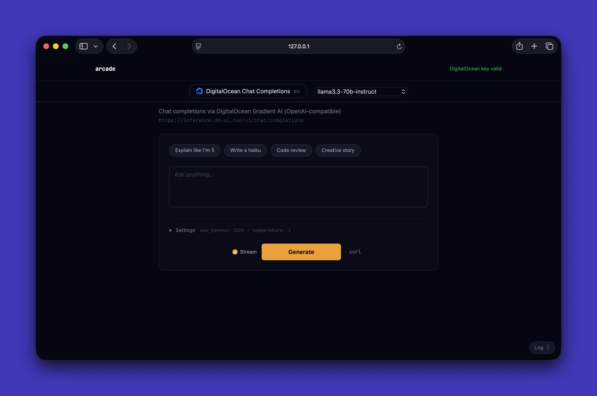
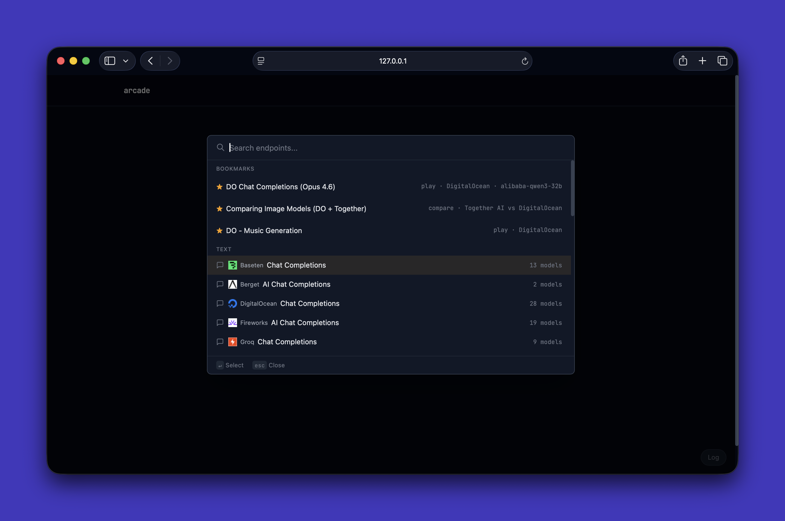
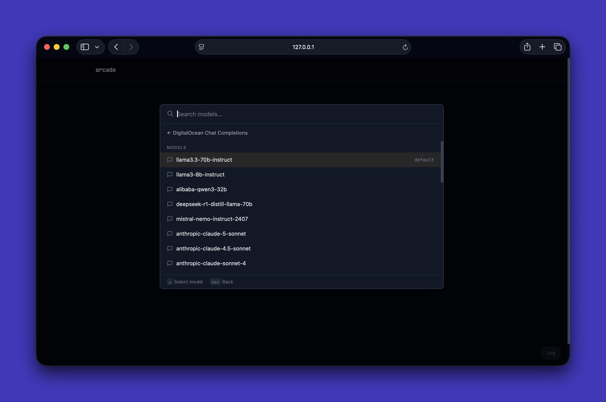
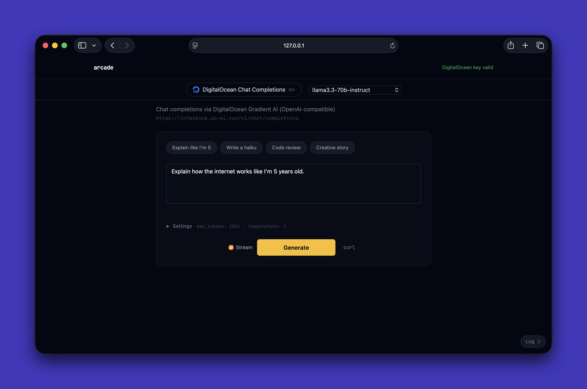
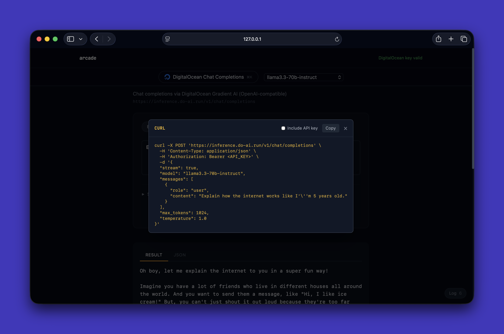
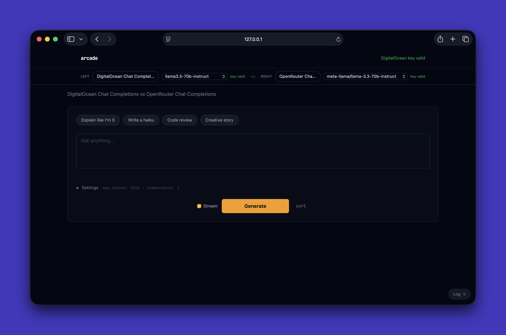
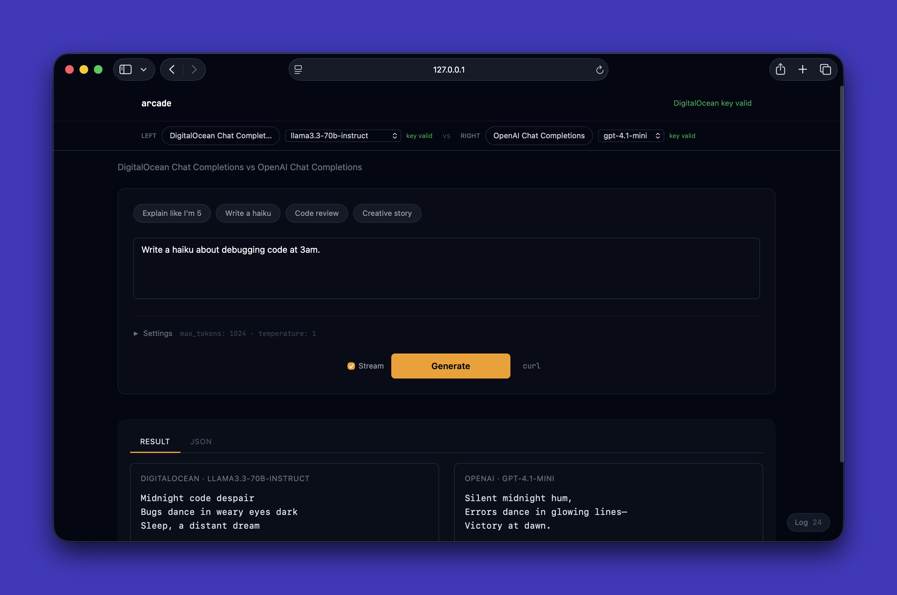
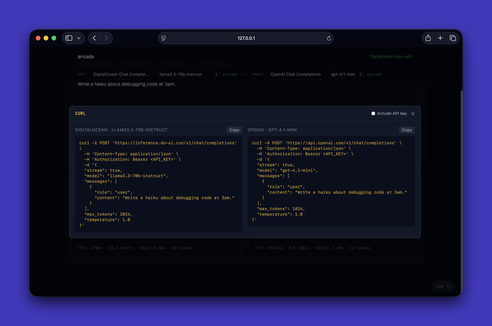

# arcade

> One playground for every AI model. Text, image, audio, video — any provider, one UI.

Arcade is a local, definition-driven playground for testing AI APIs. Instead of bouncing between provider dashboards or writing throwaway curl commands, you pick a model, fill in a form tailored to that model's actual inputs, and see the result — rendered inline as an image, audio player, or video, not a raw JSON blob.



### Why

Generic API tools show you every possible field regardless of the model you're testing. But an image generation model has completely different inputs than a chat model, and those inputs vary between providers. You end up ignoring half the form and guessing which fields matter.

Arcade solves this with **JSON definition files**. Each file describes one model endpoint — its parameters, auth, request format, and response structure. Arcade reads the definition and generates the right form with the right controls. Add a new provider by adding a file. No frontend changes. Definitions are portable and can be contributed by anyone.

### What makes it different

- **Multimodal in one place** — text, image, audio, and video generation across 16 providers
- **Adaptive UI** — each model gets a form built from its definition, showing only relevant inputs
- **Compare mode** — run two models side by side against the same prompt
- **Full transparency** — curl commands (with optional real API key), raw request/response JSON, latency metrics on every call
- **BYOK** — bring your own API keys. Keys live in `.env`, sent only to the provider's API through a local proxy, never persisted or transmitted elsewhere
- **Extensible by design** — add a provider by dropping in a JSON file, no code changes needed

## Features

### Command palette

Hit `Cmd+K` to open the command palette. Search across all endpoints, bookmarks, and saved configurations. Select an endpoint to see available models, then pick one to load the form.





### Play mode

Pick any endpoint, click an example chip to pre-fill the prompt, and hit Generate. Streaming endpoints show tokens as they arrive with TTFT and tokens/sec metrics.



### Curl preview

Inspect the exact HTTP request before or after sending. Toggle "Include API key" to copy a ready-to-run curl command.



### JSON inspector

Switch to the JSON tab to see the full request and response payloads with redacted auth headers.


### Compare mode

Run two endpoints side by side against the same prompt. Select with `Shift+Enter` from the command palette. Shared parameters are merged into one form; endpoint-specific params appear in separate columns.







### Everything else

- **Streaming, polling, and sync** — three interaction patterns, chosen per-definition
- **Stream toggle** — switch streaming endpoints to sync mode for debugging
- **Output renderers** — text (with streaming tokens), images, audio, and video
- **System prompt** — inject a system message on any chat-completions endpoint
- **Latency metrics** — time-to-first-token and tokens/sec for streaming; total duration for sync
- **Log drawer** — expandable panel showing the raw HTTP request/response
- **Bookmarks** — save and restore endpoint + param combinations from the command palette
- **Advanced params** — collapsible section for sliders (temperature, max tokens, etc.)
- **API key validation** — automatic check on startup, status shown per provider

## Providers

| Provider | Definitions | Types |
|---|---|---|
| Baseten | 1 | chat |
| Berget | 1 | chat |
| Cerebras | 1 | chat |
| DeepInfra | 2 | chat, image |
| DeepSeek | 1 | chat |
| DigitalOcean | 4 | chat, image, TTS, music |
| Fireworks | 1 | chat |
| Google | 2 | chat, image |
| Groq | 1 | chat |
| Hugging Face | 1 | chat |
| Mistral | 1 | chat |
| OpenAI | 2 | chat, image |
| OpenRouter | 3 | chat, image, audio |
| Perplexity | 1 | chat |
| SambaNova | 1 | chat |
| Together | 4 | chat, image, TTS, video |

**16 providers, 27 definitions.**

## Quick start

```bash
git clone https://github.com/ajot/arcade.git
cd arcade
python -m venv venv && source venv/bin/activate
pip install -r requirements.txt
cp .env.example .env   # add your API keys
python app.py
```

Open [http://localhost:8080](http://localhost:8080).

You only need keys for the providers you want to test. Keys are stored locally in `.env`, sent only to the provider's API through the local proxy, and never persisted or transmitted elsewhere.

## Adding a provider

Create a JSON file in `definitions/<provider>/`. The definition has four sections:

| Section | Purpose |
|---|---|
| `auth` | How to attach the API key (header name, prefix, env var) |
| `request` | URL, method, body template, and parameter definitions |
| `interaction` | Pattern (`streaming`, `polling`, or `sync`) and related config |
| `response` | Output extraction paths and types (`text`, `image`, `audio`, `video`) |

Minimal example — a streaming chat endpoint:

```json
{
  "schema_version": 1,
  "id": "myprovider-chat",
  "provider": "myprovider",
  "provider_display_name": "MyProvider",
  "name": "MyProvider Chat",
  "description": "Chat completions via MyProvider",
  "auth": {
    "type": "header",
    "header": "Authorization",
    "prefix": "Bearer ",
    "env_key": "MYPROVIDER_API_KEY"
  },
  "request": {
    "method": "POST",
    "url": "https://api.myprovider.com/v1/chat/completions",
    "content_type": "application/json",
    "body_template": { "stream": true },
    "params": [
      {
        "name": "model",
        "type": "enum",
        "options": ["model-a", "model-b"],
        "default": "model-a",
        "ui": "dropdown",
        "required": true
      },
      {
        "name": "prompt",
        "type": "string",
        "ui": "textarea",
        "required": true,
        "placeholder": "Ask anything...",
        "body_path": "_chat_message"
      }
    ]
  },
  "interaction": {
    "pattern": "streaming",
    "stream_format": "sse",
    "stream_path": "$.choices[0].delta.content"
  },
  "response": {
    "outputs": [
      { "path": "$.choices[0].message.content", "type": "text", "source": "inline" }
    ],
    "error": { "path": "$.error.message" }
  },
  "examples": [
    {
      "label": "Hello world",
      "params": { "prompt": "Say hello in 5 languages.", "model": "model-a" }
    }
  ]
}
```

Then:

1. Add `MYPROVIDER_API_KEY=` to `.env.example`
2. Run `python validate.py` to verify the definition
3. Restart the server — no code changes needed

Each parameter in `request.params` needs a `ui` type that tells Arcade how to render the form control:

| UI type | Param type | Renders as | Key fields |
|---|---|---|---|
| `textarea` | `string` | Multi-line text input | `placeholder`, `required`, `body_path` |
| `text` | `string` | Single-line text input | `placeholder`, `required` |
| `dropdown` | `enum` | Select menu | `options` (required), `default` |
| `slider` | `integer` or `float` | Range slider with numeric display | `min`, `max`, `default` |

**Parameter fields reference:**

| Field | Required | Description |
|---|---|---|
| `name` | yes | Parameter key (used in body and examples) |
| `type` | yes | `string`, `integer`, `float`, or `enum` |
| `ui` | yes | `textarea`, `text`, `dropdown`, or `slider` |
| `required` | no | If `true`, must be filled before Generate |
| `body_path` | no | Dot-separated path in the request body (e.g. `input.prompt`). Use `_chat_message` to auto-wrap as an OpenAI-style messages array |
| `options` | enum only | Array of allowed values for dropdown |
| `default` | no | Pre-filled value |
| `min` / `max` | slider only | Range bounds for the slider |
| `placeholder` | no | Hint text shown in empty inputs |
| `group` | no | Set to `"advanced"` to place in a collapsible section |

## Project structure

```
arcade/
├── app.py                  # Flask app — routes, definition loading, API proxy
├── proxy.py                # Builds HTTP requests from definitions, extracts responses
├── validate.py             # Definition schema validator
├── requirements.txt        # flask, requests, python-dotenv, gunicorn
├── .env.example            # API key template (16 providers)
├── definitions/            # One JSON file per endpoint (27 definitions)
│   ├── openai/
│   ├── together/
│   ├── digitalocean/
│   └── ...
├── templates/
│   └── index.html          # Single-page Jinja2 template with Tailwind CSS
└── static/
    ├── app.js              # Client — streaming, polling, rendering, compare mode
    └── style.css           # Arcade theme
```

## How it works

1. On startup, Flask walks `definitions/` and loads every JSON file into memory. API keys are read from `.env` based on each definition's `auth.env_key` field — no key mapping in code.
2. The page renders a command palette of all definitions. Picking one fetches its JSON and dynamically builds the form (textareas, dropdowns, sliders) from `request.params`.
3. On Generate, the client posts the definition ID and params to the Flask proxy. The proxy merges params into `body_template`, attaches auth headers, and forwards the request to the provider.
4. Based on `interaction.pattern`, the response flows back as streamed SSE tokens, polled status checks, or a single JSON payload. The client reads `response.outputs` to pick the right renderer — text, image, audio, or video.
